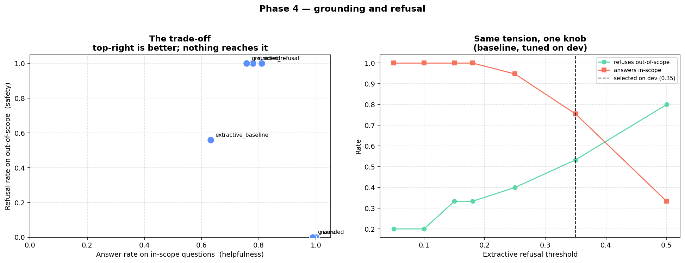

# StreamFlix RAG: is a support assistant safe to deploy?

[](https://github.com/janeruxi1/StreamFlix-RAG-evaluation/actions/workflows/ci.yml)

A retrieval-augmented question-answering system over a streaming
service's help centre, built around the part that usually gets skipped:
measuring whether it works. The deliverable is not the assistant. It is a
[decision memo](reports/decision_memo.md) that answers a stakeholder's
question, *is this safe to put in front of customers, and how would we
know?*, with every number in it checked by CI.

## The recommendation

- **Retrieval is optional at this size.** Sending the model all 45
  articles gives the same answers as retrieving. Retrieval is kept for
  the pilot on cost and headroom.
- **Pilot the `cited` prompt with a support agent in the loop.** It is
  good on the sample it was measured on, and the sample is small.
- **Do not ship the `naive` prompt.** It never refuses.

## Results

120 questions with hand-labelled sources, 25 of them deliberately
unanswerable. Generator `gpt-4o-mini`, judge `gpt-4o`. Intervals are 95%
paired bootstrap.

| Question | Result |
|---|---|
| Does it refuse what it cannot answer? | `cited` refused **25 of 25**; `naive` refused **0 of 25**. Twenty-five questions bound the true rate only at **86.7%** or better. |
| Does it make things up? | **0** fabricated citations. **3 of 76** answers had an unsupported claim (faithfulness 0.984). |
| What does the caution cost? | It declined **19 of 95** answerable questions. Correctness on answerable questions is +0.160 [+0.102, +0.219] higher for `naive`. |
| Is retrieval needed at all? | **A tie.** All 45 articles in the prompt, against BM25 retrieval: same refusals, same answer rate, correctness +0.034 [-0.041, +0.109], at 13.3x the context. |
| Which retriever? | BM25 over sections: 0.882 context recall for about 571 tokens. A transformer on the same chunks: +0.025 [-0.039, +0.090], inconclusive, so the simpler one is used. 64 configurations were compared with paired tests and a multiple-comparison correction. |
| Can the judge be believed? | It scored **100% on 9 cases** with known verdicts before any score was used; a lexical judge scores 50% on the same cases. It is lenient when an answer omits a caveat. |
| What is the evidence worth? | With a cost on a wrong answer, the refusal evidence is already enough. The bad-answer rate (3 of 76) moves the system's value **5.8x** as much, so the [pilot](reports/pilot_design.md) is sized to measure that: about 273 reviewed drafts. |



*Left: each prompt's refusal rate on unanswerable questions against its
answer rate on answerable ones. `naive` answers everything, including
what it should not. Right: the same tension in a non-LLM baseline as one
threshold moves.*

## How the evidence is kept honest

- **The test was written before the system.** The golden set and its
  source labels existed before any retrieval code, so the questions
  describe the help centre and not what the retriever happens to find.
- **The judge is tested before it is trusted.** If it fails its
  validation cases, the run stops and nothing is scored.
- **The retrieval-or-not test was pre-registered.** The rule for what
  would count as retrieval losing was
  [committed](https://github.com/janeruxi1/StreamFlix-RAG-evaluation/commit/e9bbef6)
  before the run. The result was a tie, which undercuts the retrieval
  work in this repository, and the memo leads with it.
- **Small samples are reported as bounds.** 25 of 25 is stated with its
  Wilson lower bound, because the count alone reads as a guarantee.
- **The memo cannot drift from the measurements.** Three notebooks check
  97 figures in the memo and the pilot brief against the records in
  `reports/metrics/`, and CI fails if any of them stops matching.
- **Reruns reproduce exactly.** Model responses are cached locally, so a
  second run replays the measured records byte for byte with no API
  calls. The cache is not committed; the records and run logs are.

## What it does not show

- The help centre is synthetic, and one person wrote both it and the
  questions. Nothing here is about real customer traffic.
- One generator, one judge, one run. No human has labelled the answers
  the judge scored.
- Over-refusal is diagnosed and not fixed. Given every article, the
  model still refused 13 of the 19, so the fix is a prompt change.
- Two help articles state different refund windows. No prompt surfaced
  the conflict, and the judge under-scores that failure.

## Run it

No API key is needed for any of this. CI runs it on Python 3.10 to 3.12
with only the scientific stack installed.

```bash
pip install numpy pandas scikit-learn matplotlib pytest
python -c "from src.corpus.build import write_corpus, write_golden_set; write_corpus(); write_golden_set()"

pytest tests/ -q                           # 395 tests
python notebooks/07_decision_memo.py       # checks the memo against the records
python notebooks/08_full_corpus_baseline.py
python notebooks/09_decision_model.py

pip install -r requirements.txt            # for the demo and the model run
streamlit run app/streamlit_app.py         # answers shown with their evidence
```

To re-measure with a model, which costs roughly $6 at list prices the
first time and nothing on a rerun:

```bash
python scripts/run_llm_eval.py --dry-run   # the plan and its cost
python scripts/run_llm_eval.py             # asks before spending
```

[`SETUP.md`](SETUP.md) covers the API key and a spend cap.
`requirements-lock.txt` has the exact versions behind the committed
numbers.

## Read more

| | |
|---|---|
| [Decision memo](reports/decision_memo.md) | The recommendation and its evidence. Start here. |
| [Pilot design](reports/pilot_design.md) | The cost model, break-even points and sample sizes. |
| [Scenario brief](reports/scenario_brief.md) | The stakeholder request the work answers. |
| [Phase notes](reports/phase_notes.md) | What each of the nine phases built and every finding in order, including the ones later revised. |
| [Project summary](reports/PROJECT_SUMMARY.md) | A catalogue of what was built and found, with the corrections made along the way. |

## Layout

```
src/         corpus, retrieval, llm (provider, cache, key handling),
             generation, evaluation (metrics, judge, statistics, decision model)
notebooks/   01 to 09, each a .py source of truth with a generated .ipynb
tests/       395 tests
reports/     memo, pilot brief, measured records, run logs, figures
scripts/     the credentialed run, notebook build, repository checks
app/         Streamlit demo
```

## Related projects

Part of a three-project series sharing the StreamFlix universe:

- **[A/B Test Analysis](https://github.com/janeruxi1/ab-testing-project)**: experiment design, sequential testing, CUPED, sensitivity analysis
- **[Churn & Retention](https://github.com/janeruxi1/StreamFlix-churn-retention)**: churn modelling, causal uplift, cost-aware targeting policy
