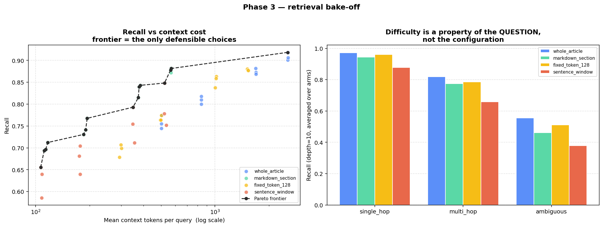

# StreamFlix RAG — Retrieval-Augmented Support with an Evaluation Harness

A question-answering system over a customer-support knowledge base, built
around the part that usually gets skipped: **measuring whether it actually
works.**

Assembling a RAG pipeline is a weekend of gluing libraries together. The
hard question is the one that follows — *is this good enough to put in
front of customers, and how would I know?* This project treats that
question as the deliverable. The retrieval and generation code exists to
give the evaluation harness something to measure.

> **Status.** Phases 1–5 are complete. Phase 6 (failure analysis) and the
> decision memo are done for the keyless baseline. **The LLM runs have not
> been executed yet** (they need an API key), so nothing here claims LLM
> answer quality. See [Status and honest gaps](#status-and-honest-gaps).


---

## Results at a glance

All numbers below are reproducible with no API key
(`python notebooks/0N_*.py`). Corpus: 45 synthetic articles; golden set:
120 questions (60 single-hop, 20 multi-hop, 15 ambiguous, 25 out-of-scope).

| Question | Answer | Where |
|---|---|---|
| Does dense retrieval beat BM25? | **No measurable difference** at depth 10: +0.009 recall, 95% CI [−0.023, +0.042], p=0.655 (paired bootstrap) | Phase 3 |
| Can chunking cut cost without losing recall? | `markdown_section` is **4.5× cheaper** (565 vs 2,543 tokens/query); recall cost bounded above by 0.084 (95%), verdict INCONCLUSIVE against a 0.05 margin | Phase 3 |
| Recommended retrieval config | `markdown_section` + BM25 @ depth 15: recall 0.882 at 571 tokens/query | Phase 3 |
| Keyless extractive baseline | 62.1% answer rate in-scope, 56.0% refusal on out-of-scope, F1 0.589, ~7 ms | Phase 4 |
| Is the keyless judge trustworthy? | **No**: 43.6% on a 39-case labelled suite (95% CI 33–55%); rates contradictions as faithful | Phase 5 |
| Where does the baseline fail? | 57/120 questions: 45 generation-owned (34 over-refusals, 11 answered-OOS), 12 retrieval-owned | Phase 6 |
| Weakest question type | `ambiguous`: recall 0.56, reaching 22% of its precision ceiling: a query-understanding problem | Phase 5 |



Decision and recommendation: [`reports/decision_memo.md`](reports/decision_memo.md).
Full methodology and the 6 findings (including two earlier conclusions
that were later overturned): [`reports/methodology_and_findings.md`](reports/methodology_and_findings.md).

---

## The central design decisions

1. **Golden set first.** Every question and its ground-truth sources were
   written before any retrieval code existed, so metrics test the system
   rather than describe it.
2. **Compute what you can, judge what you must.** Context precision and
   recall are exact from labels; only faithfulness and relevancy need a
   judge.
3. **Validate the judge before believing it.** A 39-case labelled suite
   with a Wilson-interval gate disqualifies an unreliable judge.
4. **Report uncertainty.** Paired bootstrap, Holm correction, and an
   explicit equivalence margin instead of "not significant, so equal".
5. **Publish corrections.** Findings 1, 2 and 6 record conclusions that
   were later qualified or overturned.

---

## Status and honest gaps

| Phase | Status |
|---|---|
| 1. Corpus + golden set | ✅ |
| 2. Chunking, embeddings, retrieval baseline | ✅ |
| 3. Retrieval bake-off | ✅ |
| 4. Generation, grounding, refusal | ✅ (extractive baseline measured; LLM prompt ladder implemented, **not yet run**) |
| 5. Evaluation harness + judge validation | ✅ (LLM judge **not yet run**; 39-case suite ready) |
| 6. Failure analysis | ✅ for the keyless baseline; LLM variants via `scripts/run_llm_eval.py` |
| 7. Decision memo | ✅ provisional: finalised once LLM numbers exist |

Known limitations, stated rather than hidden:

- **Synthetic corpus.** Ground truth is exact and flaws are planted, but
  real tickets are messier. Conclusions hold for this corpus, not
  production traffic.
- **95 in-scope questions** cannot rank the top retrieval configurations
  against each other (see finding 5).
- **No LLM results yet.** Run `python scripts/run_llm_eval.py --dry-run`
  for the cost estimate, then without `--dry-run` with a key configured.
  Results land in `reports/results/llm_eval.json` and notebook 06 picks
  them up automatically.
- The judge validation cases are constructed, not drawn from real system
  outputs; a human-labelled sample of real answers would be stronger.

---

## Running it

The retrieval, generation and evaluation pipeline needs **no API key and no
model download**; CI enforces this and fails if a credential is present.

```bash
pip install numpy pandas scikit-learn matplotlib pytest ruff

python -c "from src.corpus.build import write_corpus, write_golden_set; write_corpus(); write_golden_set()"

python notebooks/01_corpus_construction.py    # corpus audit + BM25 floor
python notebooks/02_chunking_embedding.py     # chunking + retrieval baseline
python notebooks/03_retrieval_bakeoff.py      # 48-config sweep (~90s)
python notebooks/04_generation.py             # grounding + refusal
python notebooks/05_evaluation.py             # eval harness + judge validation
python notebooks/06_failure_analysis.py       # failure taxonomy

pytest tests/ -q                              # 309 tests
ruff check .                                  # lint

pip install streamlit && streamlit run app/streamlit_app.py   # demo
```

For the transformer embedding arm and the LLM runs, see
[`SETUP.md`](SETUP.md), including how to configure a project-scoped key
with a spend cap.

Notebooks exist as paired `.py` and `.ipynb`. The `.py` is the source of
truth and what CI runs; the `.ipynb` is generated from it
(`python scripts/build_notebooks.py`, deterministic cell ids) and committed
with outputs stripped. `python scripts/check_repo.py` enforces repo-wide
invariants across every file, and CI fails if notebooks drift from their
sources.

---
## Security posture

This repo talks to a paid API, so credential handling is part of the
engineering rather than an afterthought.

- The API key is read from `os.environ` **at call time** in exactly one
  module (`src/llm/provider.py`). It is never stored on an object, passed
  as an argument, or written to disk.
- **16 dedicated security tests** assert the key cannot escape through the
  paths that leak credentials in practice: object `repr`, string
  formatting, pickled state, and cache filenames.
- One of those tests initially passed in a clean environment but failed
  locally, because `load_dotenv()` repopulated a deliberately-deleted
  variable. The test was non-hermetic — it was fixed, and a regression
  guard added so the suite's result no longer depends on whether a local
  `.env` exists.
- `.env` is gitignored; `.env.example` carries placeholders only.
- CI runs `detect-secrets` against a committed baseline and fails if
  `.env` ever becomes tracked.
- Cost controls are in code, not discipline: a hard per-run call ceiling
  (`MAX_LLM_CALLS_PER_RUN`) that raises rather than warns, and a response
  cache keyed on model + prompt + params — never on the key.

---

## Layout

```
src/
  corpus/      seed articles, golden set, corpus build + BM25 difficulty analysis
  retrieval/   chunking strategies, embedding backends, vector store, retrieval arms
  llm/         provider abstraction, credential masking, call budget, response cache
  generation/  prompt variants, RAG pipeline, refusal detection,
               extractive non-LLM baseline
  evaluation/  retrieval metrics, paired bootstrap, Holm correction,
               equivalence testing, Pareto frontier, LLM judge,
               judge validation suite, RAG metrics
notebooks/     01 corpus · 02 chunking + embedding · 03 retrieval bake-off
               04 generation, grounding + refusal · 05 evaluation harness
               06 failure analysis
app/           Streamlit demo (keyless extractive baseline)
scripts/       notebook build, repo invariants, real-LLM evaluation runner
tests/         309 tests — corpus, difficulty, chunking, retrieval, metrics,
               generation, refusal, provider security
data/          generated corpus + golden set (regenerable)
reports/       figures, decision memo, methodology + findings, failure analysis
```

---

## Related projects

Part of a three-project series sharing the StreamFlix universe:

- **[A/B Test Analysis](https://github.com/janeruxi1/ab-testing-project)** — experiment design, sequential testing, CUPED, sensitivity analysis
- **[Churn & Retention](https://github.com/janeruxi1/StreamFlix-churn-retention)** — churn modelling, causal uplift, cost-aware targeting policy
